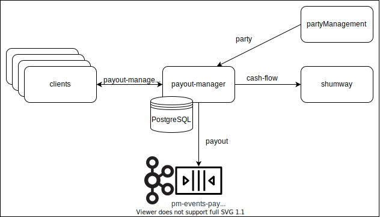
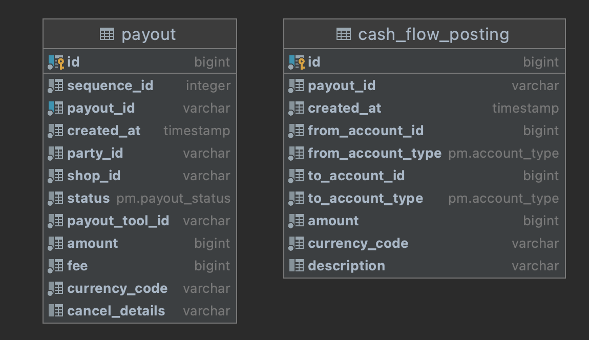

# payout-manager

Сервис для создания и управления выплатами, а также генераций событий создания и изменения выплаты.

Имплементирует сервис `PayoutManagement` протокола https://github.com/rbkmoney/payout-manager-proto

### Описание

Единственной внешней точкой входа в сервис является API `payout-manager-proto`, через это API клиент получает возможность создавать выплату, получить по ней информацию, подтвердить или отменить. При создании или изменении статуса выплаты основной задачей сервиса `payout-manager` является проксирование вызова до сервиса `shumway`, затем результат вызова (создание выплаты или изменение ее статуса) посылается в виде события с состоянием `PayoutChange` и снепшотом актуальной выплаты `Payout` в топик кафки `pm-events-payout`

### Внешние зависимости
#### PartyManagement
Сервис используется при первичном создании выплаты для получения информации о участнике и его магазинах (например, необходим `payoutToolId`), а также для подсчета  проводок (`FinalCashFlowPosting`) с изменениями баланса в рамках указанного (при вызове метода создания выплаты) количества условных единиц (кеша которое хочется вывести)

#### Shumway
Сам сервис хранит в себе историю изменения баланса кошелька (при этом история изменений в совокупности прямо говорит об актуальном балансе), а также реализует механизмы для управления балансом кошелька.  
В данном кейзе сервис используется для целевого изменения баланса кошелька. На первом этапе создания выплаты сервис `shumway` вызывается для холдирования списка проводок с изменениями баланса (подсчитанных ранее `PartyManagement`). На этом же этапе вызывается повторно для получения оставшегося баланса кошелька, если счет не проходит валидацию внутри сервиса `payout-manager`, то холдирование указанной части баланса откатывается. На следующих этапах цель (`commit`, `rollback`,`revert`) вызова сервиса `shumway` напрямую зависит от цели изменения статуса выплаты, с которой вызывают сервис `payout-manager`.

#### Postgresql

База используется для сохранения информации о выплате и проводок баланса. Эта информация используется при запросе от клиента о получении данных о выплате и при изменении статуса, для валидации внешнего вызова.

#### Kafka
Используется только в качестве продюсера для записи любых изменений по выплате. Данную информацию на текущий момент использует `magista`, `newway` и `analytics`.

